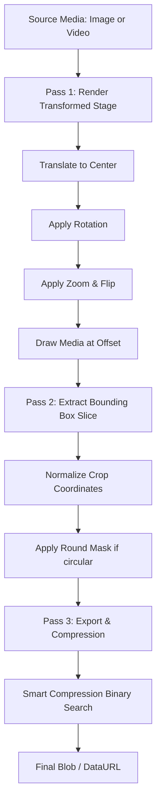
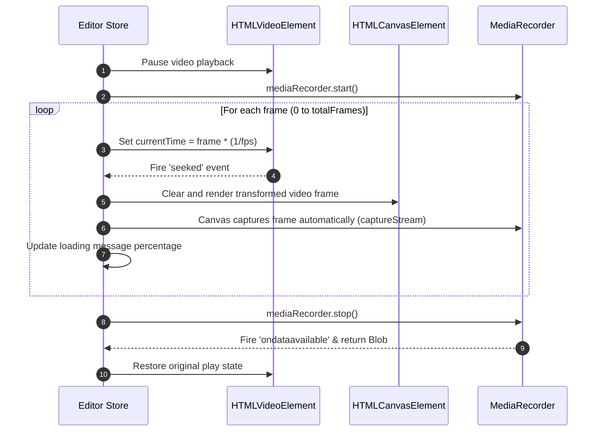

# Coordinate Math & Architecture Reference

This document explains the mathematical foundations, coordinate transformations, rendering pipelines, and architectural design of `react-modern-image-cropper`.

---

## 1. Core Architectural Overview

The cropper uses a **two-pass canvas pipeline** for rendering crops, and a **paged state history** (Undo/Redo) built on [Zustand](https://github.com/pmndrs/zustand). 



### State Management
All editor state is managed in a single high-performance store: [cropStore.ts](../src/store/cropStore.ts). 
- **Transforms** (rotation, flipH, flipV, zoom) are stored as raw numbers.
- **Crop boundaries** (crop) are stored as normalized coordinates (relative values from `0.0` to `1.0` of the stage bounds) to make them resolution-independent.
- **History snapshots** are pushed to the undo stack (`past`) on action release (pointer up, slider stop).

---

## 2. Coordinate Spaces

The system operates across three separate 2D coordinate spaces:

```
┌────────────────────────────────────────────────────────────────────────┐
│ 1. SOURCE SPACE (naturalWidth × naturalHeight)                        │
│    e.g., 4000 × 3000 pixels                                            │
└────────────────────────────────────┬───────────────────────────────────┘
                                     │ Transform Matrix (M)
                                     ▼
┌────────────────────────────────────────────────────────────────────────┐
│ 2. TRANSFORMED STAGE SPACE (stageWidth × stageHeight)                  │
│    Canvas rendering boundaries, zoomed/rotated                         │
└────────────────────────────────────┬───────────────────────────────────┘
                                     │ Normalized Crop Bounds [0..1]
                                     ▼
┌────────────────────────────────────────────────────────────────────────┐
│ 3. VIEWPORT / EXPORT SPACE (outWidth × outH)                           │
│    Final cropped result in pixels (e.g. 500 × 500)                     │
└────────────────────────────────────────────────────────────────────────┘
```

### 1. Source Space ($X_s, Y_s$)
- **Origin $(0, 0)$**: Top-left corner of the raw, unedited image/video asset.
- **Range**: $X \in [0, naturalWidth]$, $Y \in [0, naturalHeight]$.
- Operations like filters and light adjustments are applied directly to this pixel buffer.

### 2. Transformed Stage Space ($X_{stage}, Y_{stage}$)
- **Origin $(0, 0)$**: Top-left corner of the rendering canvas.
- **Center $(C_x, C_y)$**: Pivot point where rotations are calculated, equal to $(\frac{stageWidth}{2}, \frac{stageHeight}{2})$.
- Size matches the source dimensions to maintain 1:1 pixel rendering quality (lossless rendering).

### 3. Viewport Space ($X_{view}, Y_{view}$)
- Normalized boundaries representing the crop bounding box.
- Represented as fractional coordinates:
  - $x$: horizontal start offset ($0.0 \le x \le 1.0$)
  - $y$: vertical start offset ($0.0 \le y \le 1.0$)
  - $width$: crop box width ($0.0 < width \le 1.0$)
  - $height$: crop box height ($0.0 < height \le 1.0$)

---

## 3. The Transform Matrix Math

To draw the image rotated, scaled, and flipped around its true center, the canvas 2D context matrix is transformed before rendering the image.

The transform matrix $M$ is a composite of translation, rotation, and scaling transformations:

$$M = T(C_x, C_y) \cdot R(\theta) \cdot S(s_x, s_y) \cdot T(-C_x, -C_y)$$

Where:
- $T(t_x, t_y)$ shifts the space coordinate grid.
- $R(\theta)$ rotates the space grid by $\theta$ degrees.
- $S(s_x, s_y)$ scales the space grid.

### Step-by-Step Matrix Decomposition

1. **Translate to center pivot**: Move the coordinate system origin from the top-left corner $(0,0)$ to the center of the stage.
   $$T_{pivot} = \begin{bmatrix} 1 & 0 & \frac{stageWidth}{2} \\ 0 & 1 & \frac{stageHeight}{2} \\ 0 & 0 & 1 \end{bmatrix}$$

2. **Apply Rotation**: Rotate around the centered origin.
   $$R(\theta) = \begin{bmatrix} \cos(\theta) & -\sin(\theta) & 0 \\ \sin(\theta) & \cos(\theta) & 0 \\ 0 & 0 & 1 \end{bmatrix}$$

3. **Apply Scaling & Flip**: Scale the coordinate system by the zoom factor. Horizontal or vertical flips are achieved by negating the scale factor:
   - $s_x = zoom \times (-1)^{\text{flipH}}$
   - $s_y = zoom \times (-1)^{\text{flipV}}$
   
   $$S(s_x, s_y) = \begin{bmatrix} s_x & 0 & 0 \\ 0 & s_y & 0 \\ 0 & 0 & 1 \end{bmatrix}$$

4. **Draw Image Centered**: Draw the image shifted back by half its natural dimensions to keep it centered on the pivot origin.
   $$T_{offset} = \begin{bmatrix} 1 & 0 & -\frac{naturalWidth}{2} \\ 0 & 1 & -\frac{naturalHeight}{2} \\ 0 & 0 & 1 \end{bmatrix}$$

### Implementation in Code
This transformation is performed in [export.ts:L52-57](../src/utils/export.ts#L52-L57):

```typescript
sctx.save()
sctx.translate(stageW / 2, stageH / 2)
sctx.rotate((rotation * Math.PI) / 180)
sctx.scale(flipH ? -zoom : zoom, flipV ? -zoom : zoom)
sctx.drawImage(image, -naturalW / 2, -naturalH / 2, naturalW, naturalH)
sctx.restore()
```

---

## 4. Bounding Box & Normalization Math

Once Pass 1 generates the transformed stage canvas, Pass 2 extracts the cropped slice. Since the crop boundaries are normalized ($x, y, w, h \in [0, 1]$), we convert them back to absolute pixel offsets:

### Normalized to Pixel Conversion
- $\text{pixelX} = \text{round}(crop.x \times stageWidth)$
- $\text{pixelY} = \text{round}(crop.y \times stageHeight)$
- $\text{pixelWidth} = \text{round}(crop.width \times stageWidth)$
- $\text{pixelHeight} = \text{round}(crop.height \times stageHeight)$

```typescript
const pixelCrop: PixelCrop = {
  x: Math.round(crop.x * stageW),
  y: Math.round(crop.y * stageH),
  width: Math.max(1, Math.round(crop.width * stageW)),
  height: Math.max(1, Math.round(crop.height * stageH)),
}
```

The cropped section is then drawn into a new destination canvas:
```typescript
octx.drawImage(
  stage,
  pixelCrop.x,      // Source X
  pixelCrop.y,      // Source Y
  pixelCrop.width,  // Source Width
  pixelCrop.height, // Source Height
  0,                // Dest X
  0,                // Dest Y
  outW,             // Dest Width
  outH              // Dest Height
)
```

---

## 5. Resize Drag Math & Constraints

When a user drags a resizing handle (e.g. `se` for South-East), the system updates the normalized crop rect coordinates. If the aspect ratio is locked to $R$, we apply geometric constraints to prevent aspect ratio distortion.

```
(x, y) ─────────────── (x + w, y)
  │                         │
  │                         │
  │     [NW, N, NE]         │
  │     [W,      E]         │
  │     [SW, S, SE]         │
  │                         │
(x, y + h) ─────────── (x + w, y + h)
```

### Aspect Ratio Locking
Let $R$ be the locked aspect ratio ($\frac{\text{width}}{\text{height}}$).
When dragging a handle, the change in width ($\Delta w$) and change in height ($\Delta h$) are constrained so that:

$$\frac{w_{new}}{h_{new}} = R \implies w_{new} = h_{new} \times R$$

If resizing from the bottom-right corner (`se`):
1. Compute the raw candidate width and height:
   - $w_{new} = w_{old} + \Delta x$
   - $h_{new} = h_{old} + \Delta y$
2. Pick the dominant change to preserve user intention, or calculate:
   - $w_{new} = \max(w_{new}, h_{new} \times R)$
   - $h_{new} = \frac{w_{new}}{R}$
3. Clamp coordinates to ensure the crop box never exits the stage boundaries ($[0.0, 1.0]$).

The implementation of these resize constraint transforms resides in [geometry.ts](../src/utils/geometry.ts).

---

## 6. Video Recording Pipeline Architecture

Video cropping differs from images because canvases do not have timelines. To crop a video, the editor renders and records each frame sequentially.

### Real-Time vs. Frame-by-Frame Recording

Historically, recording was done in real-time using `video.play()` and recording frames at a set interval. This resulted in browser page crashes ("Aw, Snap!"), infinite recording loops, skipped frames, or slow exports.

The modern implementation uses **Programmatic Frame-by-Frame Seeking**:



### Key Benefits of seeking:
1. **Perfect Frame-Accuracy**: The recorder waits for the `seeked` event before drawing. There are zero stutters, zero duplicate frames, and zero dropped frames.
2. **Crash Prevention**: The loop is discrete and limited to $N$ frames, eliminating infinite loops and memory leaks.
3. **No Auditory Disruption**: The video remains paused during rendering, avoiding noisy audio playbacks.
